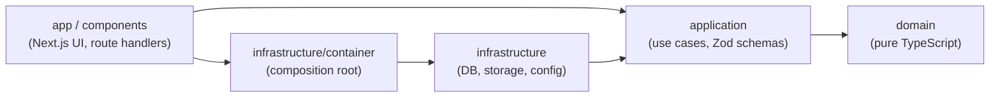

# GestTask

[](https://github.com/Wgutierrezl/gesttask-next/actions/workflows/ci.yml)
[](#testing)

A full-stack Kanban task manager on Next.js, rebuilt from two untested repositories with Clean Architecture: business rules
that do not depend on the framework, the database or the storage provider, and a test for every bug the first version had.

**Live demo:** published when the deployment goes live ([go-live checklist](docs/go-live.md)); until then run it locally in
two minutes (below). The demo is hosted on Vercel Hobby, which is for non-commercial use only; its daily cron is the most
often Hobby allows.

## Try it in 30 seconds

Press **Try the demo** on the landing page: you get your own sandbox board (3 stages, cards with priorities, due dates and
assignees, comments with attachments), no form, and may drag cards, comment and upload files. A sandbox is private to you
and is cleaned up after 24 hours. Visitors are limited (3 boards, 200 tasks, 5 attachments of up to 5 MB) so the demo
cannot be abused. An end-to-end test measures the path from the landing page to a populated board against a 30 second
budget.

## What is in it

- Email and password accounts and the one-click demo, with sessions in httpOnly cookies ([Better Auth](docs/adr/0004-better-auth.md)).
- Boards with members and roles (`owner`, `member`, `guest`), pipelines with stages, tasks with priority, due date and
  assignee, dragged between stages with the pointer or the keyboard (optimistic updates, rolled back with a message if the
  server refuses).
- Comments with up to 5 attachments, uploaded straight from the browser to the storage with a size-capped, type-pinned
  ticket ([ADR 0010](docs/adr/0010-presigned-post.md)) and downloaded through five-minute signed URLs.
- Dashboards per user and per board, each computed by one SQL statement.
- A documented REST API (OpenAPI 3.1, Scalar reference) over the same use cases as the web app.

## Architecture

Dependencies point inward only. The rules are enforced by [dependency-cruiser](https://github.com/sverweij/dependency-cruiser) (`pnpm depcruise`, also run in CI).



| Layer | May import | Must not import |
| --- | --- | --- |
| `domain` | itself | npm packages, Node built-ins, any other layer |
| `application` | `domain`, `zod` | `next`, `react`, `drizzle-orm`, `infrastructure` |
| `infrastructure` | `application`, `domain` | `app`, `components` |
| `app`, `components` | `application`, `openapi`, the container | `domain`, other `infrastructure` modules |
| `openapi` | `application`, `domain`, `zod` | `infrastructure`, `app`, `components` |

## Tech stack

- Next.js 16 (App Router, Server Actions), React 19, TypeScript (strict), Tailwind CSS 4, dnd-kit
- Zod (one schema per use case, also the source of the OpenAPI document), Drizzle ORM, PostgreSQL (Neon in production)
- Better Auth; storage behind one port with three adapters: AWS S3 (primary), Vercel Blob (fallback), local filesystem
- Vitest (unit, contract, integration), Playwright (end to end), ESLint, dependency-cruiser, GitHub Actions

The decisions behind these choices, with their costs, are in the [ADR index](docs/adr/README.md).

## Local setup

Requirements: Node 22+, pnpm (via corepack), Docker.

```bash
pnpm install
cp .env.example .env.local
pnpm db:up        # Postgres on :5433, S3-compatible RustFS on :9000 (console :9001)
pnpm db:migrate && pnpm db:seed
pnpm dev          # http://localhost:3000
pnpm db:down      # stop the local stack
```

Nothing needs a cloud account: the defaults use the local Postgres and the filesystem storage driver (`.local-storage/`).
Set `STORAGE_DRIVER=s3` and the commented S3 variables in `.env.example` to use the local RustFS instead.
Postgres is published on port 5433 to avoid clashing with a local instance on 5432.

## Scripts

| Script | Purpose |
| --- | --- |
| `pnpm dev` / `build` / `start` | Next.js development, production build, production server |
| `pnpm lint` / `typecheck` | ESLint and TypeScript checks |
| `pnpm depcruise` | Verify architecture layer boundaries |
| `pnpm openapi:validate` | Generate the OpenAPI document and validate it (also run in CI) |
| `pnpm test:unit` | Unit tests |
| `pnpm test:coverage` | Unit tests with a 90% threshold on `domain` and `application` |
| `pnpm test:integration` | Tests against real Postgres (needs `pnpm db:up`); also runs the repository contract suites |
| `pnpm e2e` | Playwright against the production build: run `pnpm build` first; recreates the `gesttask_e2e` database. One-time browser install: `pnpm exec playwright install chromium` |
| `pnpm coverage:badge` | Regenerate `docs/badges/coverage.svg` from the last `pnpm test:coverage` |
| `pnpm db:up` / `db:down` | Start or stop the local Docker stack |
| `pnpm db:migrate` / `db:seed` | Apply the migrations; create the shared demo board (idempotent) |

## Testing

| Layer | What it proves | How |
| --- | --- | --- |
| Unit | domain rules, every use case (on in-memory fakes), adapters, UI components, route handlers | `pnpm test:unit` |
| Coverage | at least 90 % lines, branches, functions and statements in `domain` and `application`, or CI fails | `pnpm test:coverage` |
| Contract | one suite per port, run against every implementation: repositories on the fakes AND on Postgres, storage on the local adapter, S3 (RustFS) and, opt-in, Vercel Blob | `pnpm test:integration` |
| Integration | cascades, uniqueness, races and deadlocks on real Postgres, the deletion outbox, the REST endpoints end to end | `pnpm test:integration` |
| End to end | guest to board, drag a card (persists after a reload), comment with an attachment that downloads back, dashboards, API docs page | `pnpm e2e` |

Tests that need real S3 or Blob credentials are opt-in and are reported as skipped, never as passed. CI
([workflow](.github/workflows/ci.yml)) runs lint, typecheck, the dependency rules, OpenAPI validation, coverage, integration
with Postgres and RustFS service containers (with the S3 contract mandatory), the Playwright suite and the build.
Design: [ADR 0016](docs/adr/0016-testing-strategy-and-ci.md).

## REST API

Every use case the web app has is also served under `/api/v1`, by the same code: a route handler gathers the input, calls the
use case through the container and translates the outcome. There is no business logic in the routes.

| URL | What |
| --- | --- |
| `/api/v1/openapi.json` | The OpenAPI 3.1 document (generated from the operation table, public) |
| `/api/docs` | Scalar API reference with a "Try it" client (self-hosted, strict CSP, same origin) |

```bash
# sign in through the app (Try demo or email), copy the session cookie from the browser, then:
curl -s -H "cookie: better-auth.session_token=<value>" "http://localhost:3000/api/v1/boards?limit=10"
curl -s -X POST -H "cookie: better-auth.session_token=<value>" -H "content-type: application/json" \
  -d '{"name":"Roadmap"}' http://localhost:3000/api/v1/boards
```

- **Auth** is the session cookie, as in the web app. A caller on a board it does not belong to gets `404`, exactly as for a
  board that does not exist; a member with too low a role gets `403`.
- **Failures before the use case** are 400 (the body is not a JSON object), 413 (body over 64 KB), 401 (checked before the
  request is parsed), 422 (schema errors) and 503 (production cannot tell clients apart: set `TRUSTED_PROXY_HOPS`).
- **Lists** answer `{ "items": [...], "nextCursor": "..." | null }`; pass `nextCursor` back as `cursor`. Paging goes no deeper than
  item 10,000.
- **Dashboards**: `GET /api/v1/dashboard` (your boards and the tasks assigned to you) and `GET /api/v1/boards/{boardId}/dashboard`
  (members and counts by pipeline, stage, priority, status and overdue; empty stages show zeros). Each is one SQL
  aggregation. The web pages are `/dashboard` and `/boards/{id}/dashboard`.
- **Errors** answer `{ "error": { "code", "message", "details?", "requestId" } }` as `application/problem+json`.
- **State-changing calls** must be `application/json` and, from a browser, come from the app's own origin.
- **Rate limits** (429 with `Retry-After`; reads and writes count separately): the client address is charged first, before the
  session is looked up (so junk cookies cost no database read), then each signed-in user per address and per user across
  addresses. Ceilings per minute: 600 reads / 120 writes per user and address; 3x that per user; 5x per address.
- To add an endpoint: declare the operation in `src/openapi/operations/`, add the one-line route file, write its contract
  test. Unit tests fail if routes, operations, the document and the contract tests ever disagree.
  Design notes: [ADR 0015](docs/adr/0015-openapi.md).

## Scheduled maintenance

`GET /api/cron/reset` runs once a day (see `vercel.json`) and needs `Authorization: Bearer $CRON_SECRET` (401 otherwise, and
closed when the variable is unset). It warms the database, purges expired demo users with their sandboxes, sweeps abandoned
uploads, deletes the storage objects left behind and trims old rate-limit windows; each job is isolated and a failure makes
the response a 500 with a report. Details: [ADR 0018](docs/adr/0018-guest-sandbox-and-scheduled-maintenance.md).

## Going live

[docs/go-live.md](docs/go-live.md) is the checklist for Neon, AWS S3 (the Budgets alert comes first), Vercel and its
environment variables, the optional Blob fallback, migrations and the smoke test. It changes configuration only.

## v1 to v2 lessons

The first GestTask was an Express and MongoDB API (about 4,500 lines, 46 endpoints, no tests) and a separate React SPA
(about 3,800 lines, no tests), deployed through Jenkins to ECS. They worked, until you looked closely. This table lists what
was wrong, what the rebuild does about it, and the test that would have caught it.

| v1 problem | What v2 does | Where it is tested |
| --- | --- | --- |
| **IDOR, four times**: `getTaskById`, `getAllTaskByPipeId`, `getAllMemberByBoardId` and `getAllBoardsMembersByUserId` returned another board's data to any signed-in user | One role table in the domain, applied inside every use case before data is returned; strangers get the same 404 as a missing id; "my" use cases take no user id ([ADR 0006](docs/adr/0006-authorization-single-policy.md)) | `tests/unit/isolation/cross-board.matrix.test.ts` (every use case as a stranger and as a weak role), the isolation sections of `tests/integration/api/*.test.ts` (every endpoint), `tests/integration/auth/session-isolation.test.ts` |
| **Tokens in the logs** (`console.log` of credentials) | A redacting structured logger is the only way to log (`no-console` is an ESLint error in `src`); signed URLs and bearer tokens are masked even inside strings | `tests/unit/logger.test.ts`, `tests/unit/auth-logger.test.ts`, `tests/unit/attachment-download-route.test.ts` |
| **`null` on success** (`!response \|\| response.length` read an empty list as a failure) | Empty is `[]`, success is success; errors are typed and thrown, never encoded in the return value ([ADR 0008](docs/adr/0008-domain-errors-to-results.md)) | `src/application/use-cases/boards/boards.test.ts` ("returns an empty list, not an error or null"), `tests/integration/api/boards.test.ts` |
| **A count of 0 treated as an error** in the dashboards | Every figure is always present; a user or board with nothing answers 200 with zeros, from one SQL aggregation | `tests/support/contracts/dashboard.contract.ts` (fakes and Postgres), `tests/integration/api/dashboard.test.ts`, `tests/integration/repos/dashboard-queries.test.ts` (one statement per view) |
| **Enums that the front end and back end spelled differently** | One enum per concept, in the domain, imported by the database schema, the Zod schemas, the UI and the OpenAPI document | `tests/integration/schema.test.ts` ("rejects values outside the enums"), `tests/unit/openapi-document.test.ts` |
| **The `priodidad` typo**, read back as `prioridad` | The value `alta` is a validation error everywhere; one schema validates the field for the action and for REST | `tests/integration/api/tasks.test.ts` (priority "alta" is a 422), `tests/integration/api/parity.test.ts` |
| **S3 errors swallowed** (the signing function returned an empty string) | `StorageError` propagates (502 with a request id); a delete that partly fails is an error, never a quiet success | `tests/contract/storage.contract.ts` ("surfaces backend failures as StorageError and never as an empty success"), `tests/unit/storage/s3.adapter.test.ts` |
| **Non-transactional cascades** (deleting a board deleted rows by hand, then files, in no transaction) | Foreign keys with `ON DELETE CASCADE` in one transaction; the storage keys are queued in the same transaction and deleted after commit by an outbox with retries ([ADR 0011](docs/adr/0011-deletion-outbox.md)) | `tests/support/contracts/boards.contract.ts` (rollback), `tests/integration/storage/cleanup-outbox.test.ts`, `tests/integration/storage/purge-and-drain.test.ts` |
| **A race in creating memberships** (two requests, two rows) | `UNIQUE (board_id, user_id)` and a conflict error, with a locking order that makes concurrent writers wait instead of deadlock | `tests/integration/concurrency/members.test.ts` (two parallel `addMember` calls leave one row), `tests/integration/concurrency/lock-order-structure.test.ts` |

What else changed, in a sentence each:

- **Two repositories became one**, so the contract between front end and back end is a shared import, not a convention.
- **Zero tests became a pyramid** ([Testing](#testing)), and the claim "it is safe" is a CI check, not a sentence in a README.
- **Authorization moved from routes to use cases.** The v1 bugs were all the same bug: a check that lived somewhere a route
  could forget it.
- **Ports only where there is a boundary.** A port for pure logic is ceremony; a port for the database or the storage is
  what lets the same contract suite run against a fake and the real thing ([ADR 0002](docs/adr/0002-hexagonal-ports-at-real-boundaries.md)).
- **Deployment you can show.** Jenkins and ECS could not be demonstrated; a Vercel deployment with a public demo can, and the
  whole app also runs from `docker compose up`.
- **What reviews found.** Reading the slices critically found real defects that tests then pinned: deadlock cycles between
  writers (reproduced as `40P01` with retries off, then fixed by a global lock order), an `instanceof` that failed only in
  the production bundle, a rate limit that did not cover junk cookies, and a pagination cursor that led to an empty page.

## Architecture decisions

All of them, with context and cost, are in the [ADR index](docs/adr/README.md).

## License

[MIT](LICENSE)
