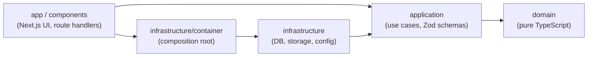

# GestTask

GestTask v2 is a full-stack Kanban task manager rebuilt on Next.js with Clean Architecture. The goal is a small, well-tested codebase where business rules are independent of the framework, the database and the storage provider.

**Status: in progress, slice 0 of 9** (scaffold, local stack and CI are in place; features start in slice 1).

## Architecture

Dependencies point inward only. The rules are enforced by [dependency-cruiser](https://github.com/sverweij/dependency-cruiser) (`pnpm depcruise`, also run in CI).



| Layer | May import | Must not import |
| --- | --- | --- |
| `domain` | itself | npm packages, Node built-ins, any other layer |
| `application` | `domain`, `zod` | `next`, `react`, `drizzle-orm`, `infrastructure` |
| `infrastructure` | `application`, `domain` | `app`, `components` |
| `app`, `components` | `application`, `openapi`, the container | `domain`, other `infrastructure` modules |
| `openapi` | `application`, `domain`, `zod` | `infrastructure`, `app`, `components` |

## Tech stack

- Next.js 16, React 19, TypeScript (strict), Tailwind CSS 4
- Zod for validation, PostgreSQL (local via Docker) and S3-compatible storage (RustFS locally)
- Vitest (unit, integration), ESLint, dependency-cruiser, GitHub Actions

## Local setup

Requirements: Node 22+, pnpm (via corepack), Docker.

```bash
pnpm install
cp .env.example .env.local
pnpm db:up        # Postgres on :5433, S3-compatible RustFS on :9000 (console :9001)
pnpm dev          # http://localhost:3000
pnpm db:down      # stop the local stack
```

Postgres is published on port 5433 to avoid clashing with a local instance on 5432.

## Scripts

| Script | Purpose |
| --- | --- |
| `pnpm dev` / `build` / `start` | Next.js development, production build, production server |
| `pnpm lint` / `typecheck` | ESLint and TypeScript checks |
| `pnpm depcruise` | Verify architecture layer boundaries |
| `pnpm openapi:validate` | Generate the OpenAPI document and validate it (also run in CI) |
| `pnpm test:unit` | Unit tests |
| `pnpm test:coverage` | Unit tests with a 90% threshold on `domain` and `application` |
| `pnpm test:integration` | Tests against real Postgres (needs `pnpm db:up`); also runs the repository contract suites |
| `pnpm db:up` / `db:down` | Start or stop the local Docker stack |

## REST API

Every use case the web app has is also served under `/api/v1`, by the same code: a route handler gathers the input, calls the
use case through the container and translates the outcome. There is no business logic in the routes.

| URL | What |
| --- | --- |
| `/api/v1/openapi.json` | The OpenAPI 3.1 document (generated from the operation table, public) |
| `/api/docs` | Scalar API reference with a "Try it" client (self-hosted, strict CSP, same origin) |

```bash
# sign in through the app (Try demo or email), copy the session cookie from the browser, then:
curl -s -H "cookie: better-auth.session_token=<value>" "http://localhost:3000/api/v1/boards?limit=10"
curl -s -X POST -H "cookie: better-auth.session_token=<value>" -H "content-type: application/json" \
  -d '{"name":"Roadmap"}' http://localhost:3000/api/v1/boards
```

- **Auth** is the session cookie, as in the web app. A caller on a board it does not belong to gets `404`, exactly as for a
  board that does not exist; a member with too low a role gets `403`.
- **Failures before the use case** are 400 (the body is not a JSON object), 413 (body over 64 KB), 401 (checked before the
  request is parsed), 422 (schema errors) and 503 (production cannot tell clients apart: set `TRUSTED_PROXY_HOPS`).
- **Lists** answer `{ "items": [...], "nextCursor": "..." | null }`; pass `nextCursor` back as `cursor`. Paging goes no deeper than
  item 10,000.
- **Dashboards**: `GET /api/v1/dashboard` (your boards and the tasks assigned to you) and `GET /api/v1/boards/{boardId}/dashboard`
  (members and counts by pipeline, stage, priority, status and overdue; empty stages show zeros). Each is one SQL
  aggregation. The web pages are `/dashboard` and `/boards/{id}/dashboard`.
- **Errors** answer `{ "error": { "code", "message", "details?", "requestId" } }` as `application/problem+json`.
- **State-changing calls** must be `application/json` and, from a browser, come from the app's own origin; they are rate
  limited per client (429 with `Retry-After`).
- To add an endpoint: declare the operation in `src/openapi/operations/`, add the one-line route file, write its contract
  test. Unit tests fail if routes, operations, the document and the contract tests ever disagree.
  Design notes: [ADR 0015](docs/adr/0015-openapi.md).

## Lessons from v1

_To be written in slice 9._

## License

[MIT](LICENSE)
