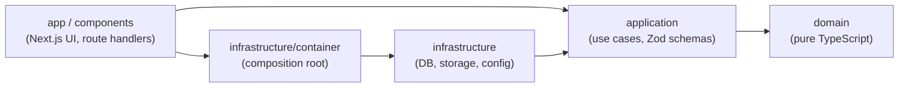

# GestTask

GestTask v2 is a full-stack Kanban task manager rebuilt on Next.js with Clean Architecture. The goal is a small, well-tested codebase where business rules are independent of the framework, the database and the storage provider.

**Status: in progress, slice 0 of 9** (scaffold, local stack and CI are in place; features start in slice 1).

## Architecture

Dependencies point inward only. The rules are enforced by [dependency-cruiser](https://github.com/sverweij/dependency-cruiser) (`pnpm depcruise`, also run in CI).



| Layer | May import | Must not import |
| --- | --- | --- |
| `domain` | itself | npm packages, Node built-ins, any other layer |
| `application` | `domain`, `zod` | `next`, `react`, `drizzle-orm`, `infrastructure` |
| `infrastructure` | `application`, `domain` | `app`, `components` |
| `app`, `components` | `application`, the container | `domain`, other `infrastructure` modules |

## Tech stack

- Next.js 16, React 19, TypeScript (strict), Tailwind CSS 4
- Zod for validation, PostgreSQL (local via Docker) and S3-compatible storage (RustFS locally)
- Vitest (unit, integration), ESLint, dependency-cruiser, GitHub Actions

## Local setup

Requirements: Node 22+, pnpm (via corepack), Docker.

```bash
pnpm install
cp .env.example .env.local
pnpm db:up        # Postgres on :5433, S3-compatible RustFS on :9000 (console :9001)
pnpm dev          # http://localhost:3000
pnpm db:down      # stop the local stack
```

Postgres is published on port 5433 to avoid clashing with a local instance on 5432.

## Scripts

| Script | Purpose |
| --- | --- |
| `pnpm dev` / `build` / `start` | Next.js development, production build, production server |
| `pnpm lint` / `typecheck` | ESLint and TypeScript checks |
| `pnpm depcruise` | Verify architecture layer boundaries |
| `pnpm test:unit` | Unit tests |
| `pnpm test:coverage` | Unit tests with a 90% threshold on `domain` and `application` |
| `pnpm test:integration` | Tests against real Postgres (needs `pnpm db:up`); also runs the repository contract suites |
| `pnpm db:up` / `db:down` | Start or stop the local Docker stack |

## Lessons from v1

_To be written in slice 9._

## License

[MIT](LICENSE)
